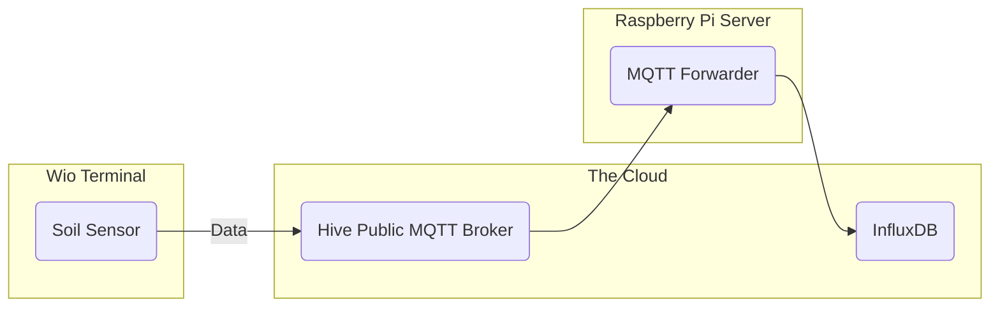
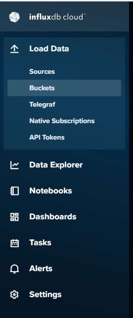
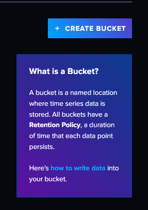
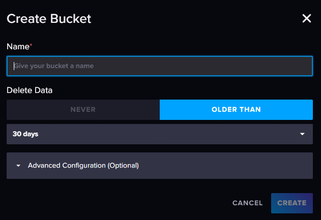
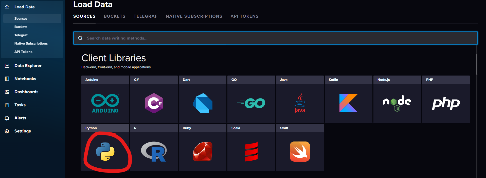
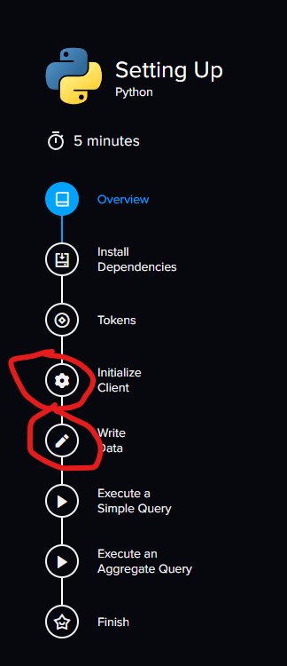
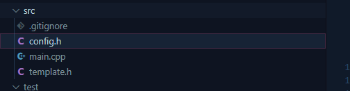
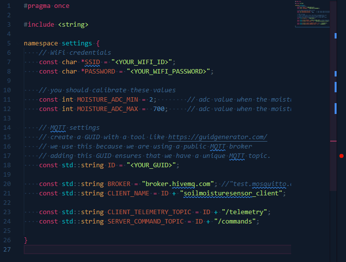
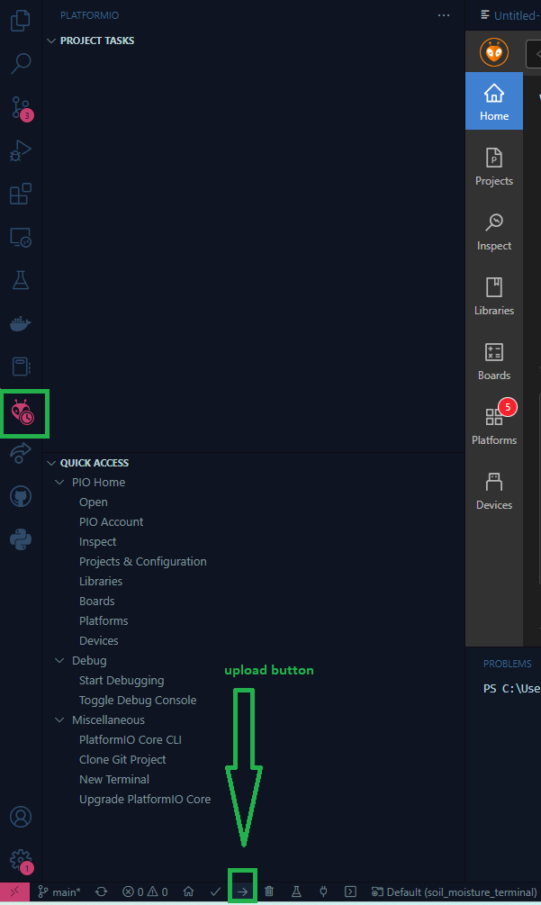

# Soil Moisture Sensor

This project just collects moisture data of your soil to help you better take care of your plants.

Below shows how data gets transferred from the soil sensor to [Influx Data](https://www.influxdata.com/). Influx data will serve both as part of the middleware layer that hosts all the data and also the application layer to help users interact with the data via its dashboard feature.



**🙋‍♂️ If you want to host your own MQTT broker on the Raspberry Pi, just refer to the appendix section [below](#install-a-mqtt-broker-on-the-raspberry-pi)**

### Features

- Capture Soil Moisture % using a moisture sensor

- Collects and Soil Moisture telemetry to [Influx Data](https://www.influxdata.com/)

- Display Moisture % on Wio Terminal Display

## Materials Needed

- [ ] [Wio Terminal Microcontroller](https://www.seeedstudio.com/Wio-Terminal-p-4509.html)
- [ ] [Grove Moisture Sensor](https://www.seeedstudio.com/Grove-Moisture-Sensor.html?queryID=1ae25888b4cf8394c9027ab2d43df9af&objectID=1678&indexName=bazaar_retailer_products)

## Tools

- [ ] Laptop or Computer

## Pre-requisites

1. [Visual Studio Code](https://code.visualstudio.com/)

2. [Platformio IDE Extension on Visual Studio Code](https://platformio.org/platformio-ide)

## Steps

#### 1 - Create a InfluxData Account

Based off of instructions from [Random Nerd Tutorials](https://randomnerdtutorials.com/esp8266-nodemcu-influxdb/)

1. Create a influx data cloud account: [InfluxDB Cloud](https://cloud2.influxdata.com/signup)
   
   

2. Select where to save your data
   
   

3. Select the free plan
   
   

4. Create a Bucket.
   
   On the left side panel, click **Load Data** then click **Buckets**
   
   
   
   Then click the **Create Bucket** button on the right
   
   
   
   You'll give your bucket a name then click on the **Create** button ?��
   
   

5. Collect the influx DB credentials
   
   Go to **Sources** then scroll down and click **Python**
   
   
   
   Copy your token from the **Tokens** section and other information listed below from the **Initialize Client Section**
   
   - INFLUX_TOKEN
   
   - INFLUX_ORG
   
   - INFLUX_URL
   
   - INFLUX_BUCKET
     
     

#### 2 - Setup Config file for WIO Terminal

1. Copy `template.h` file as `config.h` in the same parent folder
   
   ```bash
   cd <path_to_repo>/is-my-soil-moist/soil_moisture_terminal/src/
   cp template.h config.h
   ```
   
   

2. Replace the following values in your `config.h` file with the appropriate ones
   
   - `<YOUR_WIFI_ID>`
   
   - `<YOUR_WIFI_PASSWORD>`
   
   - `<YOUR_GUID>`
   
   

#### 2 - Upload code to WIO Terminal

1. Connect your Wio Terminal to your Computer with a USB-C Cable
2. Turn on your Wio Terminal
3. Hit the upload button on Platform IO 
   
   

#### 3 - Run Python MQTT Forwarder Code

1. Clone the repo
   
   ```bash
   git clone 
   ```

2. Install the following libraries
   
   ```bash
   pip3 install
   ```

3. Run the following code
   
   ```bash
   python3
   ```

Refer the the appendix section for a great time

## Appendix

#### Install a MQTT Broker on the Raspberry Pi

If you want to use your own MQTT Broker hosted on the Raspberry Pi instead of the public mosquitto

. broker.

1. First install
   
   ```bash
   sudo apt get update
   sudo apt install mosquitto mosquitto-clients
   sudo reboot
   ```

2. Test your installation
   
   ```bash
   sudo systemctl enable mosquitto
   ```

3. Edit the `mosquitto.conf` file
   
   ```bash
   sudo nano /etc/mosquitto/mosquitto.conf
   ```
   
   Replace
   
   ```
   include_dir /etc/mosquitto/conf.d
   ```
   
   with
   
   ```
   allow_anonymous true
   listener 1883
   ```

4. Restart mosquitto service.
   
   ```bash
   sudo systemctl restart mosquitto
   ```
   
   The configuration should be applied and the broker will listen on port 1883.

5. To test if you are able to publish/subscribe to your MQTT Broker. Use another computer connected to the same local network.
   
   ```bash
   sudo apt install mosquitto-clients
   ```
   
   Subscribe to a topic in one terminal window
   
   ```bash
   mosquitto_sub  -h <raspberry_pi_ip_address> -p 1883 -v -t test/message
   ```
   
   Publish to the topic in another terminal window. Replace `<raspberry pi ip address> ` with your rasp pi ip address
   
   ```bash
   mosquitto_pub -h <raspberry_pi_ip_address> -t test/message -m 'Hello World!'
   ```
   
   You should be able to see a response from the subscribe terminal window! This was my output
   
   ```bash
   test/message Hello World!
   ```

If you're running into trouble with the test above. you may be experiencing some firewall issues. You can refer to this stack overflow post: [**Stack Overflow - mosquito server refuses connections**](https://askubuntu.com/questions/1121524/mosquito-server-refuses-connections-ubuntu-18-04) .

## References

- [**Random Nerd Tutorials | esp32 InfluxDB**](https://randomnerdtutorials.com/esp32-influxdb/) - quick guide for how to use influxdb cloud

- [**PubSub Client API Documentation**](https://pubsubclient.knolleary.net/api) - Documentation on the PubSub Client used in the PlatformIO Environment

- [**IoT-For-Beginners/app.py at main · microsoft/IoT-For-Beginners · GitHub**](https://github.com/microsoft/IoT-For-Beginners/blob/main/2-farm/lessons/3-automated-plant-watering/code-mqtt/server/app.py) - A free Microsoft Course on IoT Basic Concepts. The lessons here also used the Wio Terminal and has helped me a lot with setting up the code.

- [**HIVE MQTT Arduino PubsubClient**](https://www.hivemq.com/blog/mqtt-client-library-encyclopedia-arduino-pubsubclient/) - Resource in setting up a MQTT Client with Arduino

- [**HIVE MQTT Python Client**](https://www.hivemq.com/blog/mqtt-client-library-paho-python/) - Resource in setting up a MQTT Client with Python

- [**IoT4 Beginners - Install MQTT Broker on Raspberry Pi**](https://iot4beginners.com/mosquitto-mqtt-broker-on-raspberry-pi/) - Helped me get started on installing and setting up my Raspberry Pi

- [**HacksterIO - Running a MQTT Broker on Raspberry Pi**](https://www.hackster.io/dhairya-parikh/running-a-mqtt-broker-on-raspberry-pi-63c348) - Also helped me get started on installing and setting up my Raspberry Pi

- [**Stack Overflow - mosquito server refuses connections**](https://askubuntu.com/questions/1121524/mosquito-server-refuses-connections-ubuntu-18-04) - Helped me figure out how to disable a firewall for port 1883 (the default mqtt broker port)

- [**Stack Overflow - mosquitto client refused connection**](https://stackoverflow.com/questions/24556160/mosquitto-client-obtain-refused-connection) - this guide helped me figure what to add to my `mosquitto.conf` file when I kept getting a `client refused connection` error